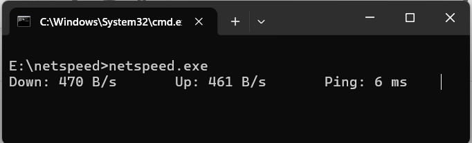

# NetSpeed
 
A small background utility written in C that shows live network speed on Windows.
Currently a console tool; a system tray icon with the speed drawn into it is in progress.
 
**Status:** in development — Milestones 0–2 complete.
 
---
 
## Screenshots
 
### Live readout
 
<!-- TODO: screenshot of netspeed.exe running, showing Down / Up / Ping -->

 
### Interface detection
 
<!-- TODO: screenshot of `netspeed.exe --list` output -->

 
---
 
## What it does
 
- Reports download and upload speed once per second, in bytes
- Reports round-trip latency to `1.1.1.1`, sampled every 5 seconds
- Detects active network interfaces automatically — works on Wi-Fi,
  Ethernet, or a phone hotspot with no configuration
- `--list` shows which interfaces are being counted and why
---
 
## Build
 
Requires [MSYS2](https://www.msys2.org/) with the UCRT64 toolchain.
 
```
pacman -S mingw-w64-ucrt-x86_64-gcc mingw-w64-ucrt-x86_64-make
```
 
Add `C:\msys64\ucrt64\bin` to `PATH`, then from the project root:
 
```
make           # debug build, keeps the console
make release   # optimised, console hidden (-mwindows)
```
 
---
 
## Usage
 
```
netspeed.exe           # live readout
netspeed.exe --list    # show detected interfaces
```
 
Press Ctrl+C to stop.
 
---
 
## How it works
 
Windows keeps a cumulative byte counter for every network interface.
`GetIfTable2()` returns the whole table; the program reads it once a second and
derives speed from the difference between consecutive readings:
 
```
speed = (bytes_now - bytes_before) / seconds_elapsed
```
 
Two details that the obvious implementation gets wrong:
 
**Elapsed time is measured, not assumed.** `Sleep(1000)` guarantees only a
minimum. Each reading is timestamped with `GetTickCount64()` and the real
interval is used, so readings stay accurate when the system is loaded.
 
**Counters can go backwards.** Switching networks or resetting an adapter
restarts its counter at zero. Since the counters are unsigned, a naive
subtraction wraps to an enormous positive number instead of going negative, so
the difference is guarded with a comparison rather than a sign check.
 
Latency uses `IcmpSendEcho` from the IP Helper API, which needs no administrator
rights. It is sampled every fifth tick rather than every tick because the call
blocks until a reply arrives or the timeout expires.
 
### Interface selection
 
Windows reports far more interfaces than a machine actually has — this one lists
54. Most are filter drivers layered on a real adapter, and each reports the
*same* bytes as the adapter beneath it. Summing them all inflates the reading
several times over.
 
Interfaces are filtered on the `MIB_IF_ROW2` status flags:
 
| Rule | Reason |
|---|---|
| `HardwareInterface` must be set | excludes virtual switches (Hyper-V, WSL2) |
| `FilterInterface` must be clear | excludes stacked driver layers that double-count |
| `OperStatus` must be `Up` | excludes disconnected adapters |
| Type must not be loopback or tunnel | excludes local traffic and VPN double-counting |
 
On a typical laptop this reduces 54 rows to one.
 
---
 
## Known limitations
 
- Windows only — built entirely on Win32 APIs
- Reports **bytes**, not bits. Speed test sites report megabits;
  divide their figure by 8 to compare
- Uses binary units (1 MB = 1024²  bytes), unlike most network tools
- Polls once a second, so brief spikes are averaged away
- Traffic through a VPN is counted at the physical adapter, so it reflects
  encrypted wire traffic rather than the plaintext inside the tunnel
- Latency probe blocks briefly on a dead connection
---
 
## Roadmap
 
- [x] M0 — Toolchain, Makefile, repo
- [x] M1 — Console readout with clock-drift and counter-reset handling
- [x] M2 — Automatic interface detection, `--list`
- [ ] M3 — Tray icon with live tooltip
- [ ] M4 — Right-click menu, survives Explorer restarts
- [ ] M5 — Speed drawn into the 16×16 icon itself
- [ ] M6 — Config file, daily usage log, autostart, real icon
### Future work
 
- `--list-all` to show the full unfiltered interface table
- Move the latency probe to a worker thread so it can never block the UI
- Exclude interfaces by alias from the config file
---
 
## License
 
MIT
 