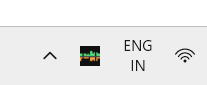
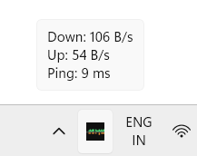
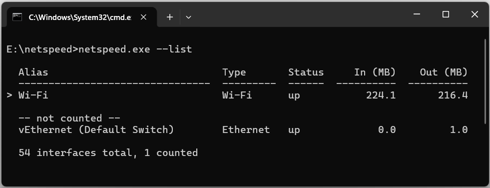
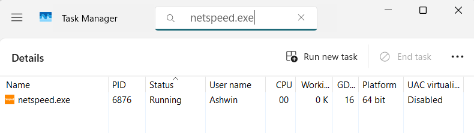

# NetSpeed
 
A small background utility written in C that shows live network activity as a
Windows system tray icon. The icon is redrawn every second as a scrolling
sparkline, so you can see what the connection is doing without hovering over
anything.
 
Roughly 600 lines of C11 on the Win32 API. No external dependencies.
 
---
 
## Screenshots
 
### The tray icon
 
<!-- TODO: zoomed screenshot of the sparkline in the taskbar -->

 
Download above the midline in green, upload below in orange, sixteen seconds of
history scrolling right to left.
 
### Tooltip
 
<!-- TODO: screenshot of the hover tooltip -->

 
### Interface detection
 
<!-- TODO: screenshot of `netspeed.exe --list` -->

 
Windows reports 54 interfaces on this machine. One of them carries traffic.
 
### Resource usage
 
<!-- TODO: Task Manager screenshot showing netspeed.exe CPU / memory / GDI columns -->

 
One poll per second, one icon redrawn per second, and that is the whole workload.
CPU sits at 0% between ticks — the process is asleep in `GetMessage` until
Windows wakes it. The GDI object count settles in the mid-teens and stays there
for as long as the app runs, which is the visible proof that the per-second icon
generation cleans up after itself.
 
The working set is small enough that Windows pages most of it out during idle
periods and reports near zero, which is roughly the point: a tray utility should
cost nothing to leave running.
 
---
 
## Features
 
- Live sparkline drawn into the 16×16 tray icon, regenerated every second
- Exact download, upload, and latency figures on hover
- Automatic interface detection — Wi-Fi, Ethernet, or a phone hotspot, with no
  configuration
- Right-click menu: reset counters, toggle start-with-Windows, exit
- Survives Explorer restarts — the icon comes back on its own
- Optional config file for poll interval, ping target, and probe frequency
- Daily usage totals appended to a CSV
- `--list` shows which interfaces are counted and why
---
 
## Build
 
Requires [MSYS2](https://www.msys2.org/) with the UCRT64 toolchain:
 
```
pacman -S mingw-w64-ucrt-x86_64-gcc mingw-w64-ucrt-x86_64-make
```
 
Add `C:\msys64\ucrt64\bin` to `PATH`, then from the project root:
 
```
make           # debug build, keeps the console
make release   # optimised, console hidden (-mwindows)
```
 
Builds clean with `-Wall -Wextra`, no warnings.
 
---
 
## Usage
 
```
netspeed.exe           # run in the tray
netspeed.exe --list    # show detected interfaces and exit
```
 
Right-click the icon for the menu, or double-click to exit.
 
Windows hides new tray icons by default. To keep NetSpeed visible:
**Settings → Personalization → Taskbar → Other system tray icons → NetSpeed → On**
 
### Configuration
 
Optional. Create `netspeed.cfg` beside the exe:
 
```
# NetSpeed configuration
interval_ms=1000
ping_target=1.1.1.1
ping_every=5
```
 
Missing file or missing keys fall back to these defaults. Values outside sane
ranges are ignored rather than applied.
 
### Usage log
 
Daily totals are appended to `netspeed-usage.csv` beside the exe, one line per
day:
 
```
2026-09-14,4821993472,318204928
```
 
Date, bytes down, bytes up. Totals accumulate in memory and are written when the
date rolls over, so the file is touched once a day rather than once a second.
 
---
 
## How it works
 
### Measuring speed
 
Windows keeps a cumulative byte counter per network interface. `GetIfTable2()`
returns the whole table; the program reads it once a second and derives speed
from the difference between consecutive readings:
 
```
speed = (bytes_now - bytes_before) / seconds_elapsed
```
 
Two details the obvious implementation gets wrong:
 
**Elapsed time is measured, not assumed.** `WM_TIMER` guarantees only a minimum
interval — under load it can arrive noticeably late. Each reading is timestamped
with `GetTickCount64()` and the real interval is used, so readings stay accurate
exactly when the machine is busiest.
 
**Counters can go backwards.** Switching networks or resetting an adapter
restarts its counter at zero. The counters are unsigned, so a naive subtraction
wraps to an enormous positive number rather than going negative — the difference
is guarded with a comparison, not a sign check.
 
Latency uses `IcmpSendEcho` from the IP Helper API, which needs no administrator
rights, unlike raw sockets. It is sampled every fifth tick because the call
blocks until a reply arrives or the timeout expires.
 
### Interface selection
 
Windows reports far more interfaces than a machine has — 54 on the development
laptop. Most are **filter drivers** layered on a real adapter: WFP, QoS Packet
Scheduler, Native WiFi. Each reports the *same* bytes as the adapter beneath it,
so summing them inflates the reading several times over. The first working
version read roughly six times high for exactly this reason.
 
Interfaces are filtered on the `MIB_IF_ROW2` status flags:
 
| Rule | Reason |
|---|---|
| `HardwareInterface` must be set | excludes virtual switches (Hyper-V, WSL2) |
| `FilterInterface` must be clear | excludes stacked driver layers that double-count |
| `OperStatus` must be `Up` | excludes disconnected adapters |
| Type must not be loopback or tunnel | excludes local traffic and VPN double-counting |
 
On a typical laptop this reduces 54 rows to one. `--list` prints the decision for
every interface, which turns "why is the number wrong?" into a thirty-second
check.
 
### Drawing the icon
 
The tray accepts only a 16×16 icon — there is no API for putting text in the
taskbar. So a fresh icon is generated every second: a memory DC, a colour bitmap
and a mask bitmap, the sparkline drawn with `FillRect`, then
`CreateIconIndirect` and `Shell_NotifyIcon(NIM_MODIFY)`.
 
**Why a sparkline and not digits.** The first attempt drew the speed as text. At
16 pixels only two or three characters fit, there is no room for a unit suffix,
and encoding the unit as text colour proved unreadable at a glance. Shapes
survive the resolution where glyphs do not, so the icon carries shape and trend
while the tooltip carries exact numbers.
 
**Scaling is logarithmic.** Throughput spans five orders of magnitude, from a few
hundred B/s of background chatter to tens of MB/s. Scaling linearly against a
rolling peak makes everything except the peak invisible, and the meaning of
"tall" changes from second to second. A fixed `log10` scale means a given bar
height always represents the same speed.
 
### The GDI handle trap
 
This is the part worth reading.
 
`CreateIconIndirect` copies the bitmaps it is given, so they must be deleted
immediately afterwards — and the icon installed on the *previous* tick must be
destroyed once the shell has taken the new one.
 
Miss either and the process leaks one GDI handle per second. Windows caps a
process at 10,000 GDI objects. At one per second the ceiling arrives in under
three hours, `CreateIconIndirect` starts returning `NULL`, and the icon silently
stops updating. No crash, no error, no log entry — just a frozen icon.
 
<!-- TODO: before/after screenshot of the GDI objects column in Task Manager -->

 
Task Manager's **GDI objects** column (Details tab → right-click headers →
Select columns) makes it visible: a leaking build climbs steadily, a correct one
sits flat indefinitely.
 
The same discipline applies throughout — every `CreatePopupMenu` has a matching
`DestroyMenu`, every `CreateFont` a `DeleteObject`, and GDI objects are
unselected from their DC before being deleted, since a selected object cannot be
freed and `DeleteObject` fails silently when you try.
 
### Surviving Explorer restarts
 
When `explorer.exe` restarts, the taskbar is rebuilt and every tray icon is
wiped. The process keeps running, but invisibly, with no way to reach it except
Task Manager. Windows broadcasts a `TaskbarCreated` message when the new taskbar
is ready; registering for it via `RegisterWindowMessage` and re-adding the icon
on receipt fixes this.
 
This is also why the program creates a hidden top-level window rather than a
message-only (`HWND_MESSAGE`) one. Message-only windows are excluded from
broadcasts by design, so the tempting shortcut would have made this feature
impossible without restructuring.
 
### Two Win32 quirks worth knowing
 
**Popup menus need coaxing.** `TrackPopupMenu` dismisses a menu when it detects a
click outside it, and that detection depends on the owning window being in the
foreground. A hidden window never is, so the menu simply refuses to close.
`SetForegroundWindow` before the call fixes it; `PostMessage(hwnd, WM_NULL, 0, 0)`
after fixes a second issue where the first dismissal after gaining foreground
fails. Both are documented Microsoft quirks that have never been fixed.
 
**Registry paths must be quoted.** The autostart entry writes a quoted path to
`HKCU\...\Run`. Unquoted, Windows parses `C:\Program Files\App\x.exe` by trying
`C:\Program.exe` first — a well-known privilege-escalation vector.
 
---
 
## Known limitations
 
- Windows only — built entirely on Win32 APIs
- Reports **bytes**, not bits. Speed test sites report megabits; divide their
  figure by 8 to compare
- Uses binary units (1 MB = 1024² bytes), unlike most network tools
- Polls once a second, so brief spikes are averaged away
- Traffic through a VPN is counted at the physical adapter, so it reflects
  encrypted wire traffic rather than the plaintext inside the tunnel
- The latency probe runs on the UI thread and blocks for up to a second on a
  dead connection
- The daily total is held in memory until the date rolls over, so a crash loses
  the current day
---
 
## Future work
 
- `--list-all` to show the full unfiltered interface table
- Move the latency probe to a worker thread so it can never block the UI
- Exclude interfaces by alias from the config file
- Configurable colours and scale factor
---
 
## License
 
MIT
 